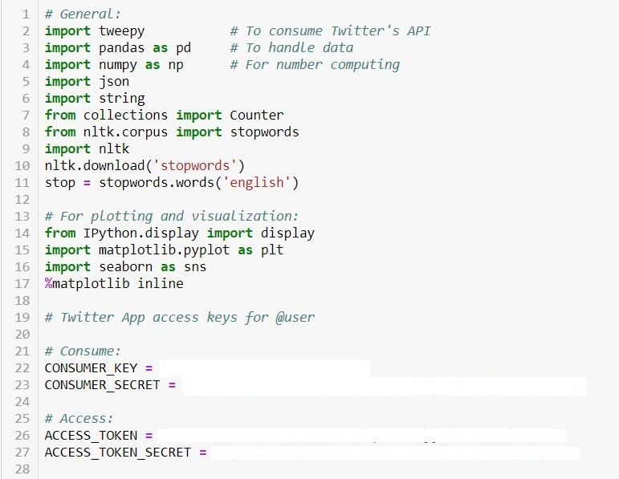
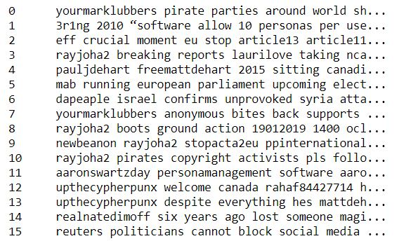

   # Portfolio
### Applied Data Science, KB-74
### Petri Johannes Pellinen
### Student Number: 18116256

1. ### Introduction

My name is Petri Pellinen, I am a 25-year old student from Tampere, Finland. At my home university (Tampere University of Applied Sciences) I study software engineering in the department of ICT-engineering. This is my third year of a four-year program to graduate with a title of ICT-engineer or Bachelor of Science. I’m now studying Applied Data Science in The Hague University of Applied Sciences. It is a course of different group projects. My project group is working on a project called Cyber Security. In the project we use machine learning and programming skills learned as the course goes on. Programming learning happens mainly in learning environment called Data Camp, where we are assigned programming tasks to complete. This portfolio is a proof of my efforts on the group project.

2. ### Jargon
 
Frequent and important words used in Cybersecurity.

 * _API_.- Abbreviation for application programming interface: a way ofcommunicating with a particular computer program or internet service.
 
 * _Cyberattack_.- An attempt by hackers to damage or destroy a computer network or system.
 
 * _Cybersecurity_.- The state of being protected against the criminal or unauthorized use of electronic data, or the measures taken to achieve this.
 
 * _Hacktivism_.- The activity of getting into computer systems without permission inorder to achieve political aims.
 
 * _Hacktivist_.- A person who gains unauthorized access to computer files or networks in order to further social or political ends.
 
 * _Sentiment Analysis_.- The process of computationally identifying and categorizing opinions expressed in a piece of text, especially in order to determine whether the writer's attitude towards a particular topic, product, etc. is positive, negative, or neutral.
 
 * _Social media_.- Refers to websites and computer programs that make communication possible with the use of computers or mobile phones.

                
3. ### Project overwiev

Social networks have been a powerful platform to achieve globalization in recent years, huge amounts of data is generated every day. Sharing information with a large demographic has never been easier. Our focus on this project is one of the most popular social media platforms; Twitter. More importantly for us, we focus on a problem called hacktivism. Hacktivism is the use of technology to promote political agenda or social change. Hacktivists often promote something like freedom of information and human rights, of which both are very important but the methods are often questionable.
‘Cyber Security’ is a project that aims to create two working classifiers for Twitter data. The main goal is identifying hacktivists based on their tweets. This is achieved by building two classifiers with different functions and machine learning and training them with Twitter data. The two classifiers tell if the user is involved in the hacktivism scene and the machine learning part tries to detect patterns and make predictions on Twitter data. In this kind of data, some text pre-processing and manual labelling is necessary before the data can be actually used in the classifiers. My effort on the project focused mainly on the data cleaning and processing.

4. ### Data Camp  

Here is a proof of completing the assigned tasks in Data Camp. In the picture is the main banner of my Data Camp account showing XP earned and the amount of completed courses and exercises and the proof of completion of assigned tasks.
    
     
   
   
   
     
     
 5. ### Coursera
 
 Here is a proof of completing the assigned tasks in Coursera. In these pictures are screen shots from the course overview and the completed tasks from the machine learning course.
 
 
 
     
 6. ### My Work on the project
 
 In this chapter I will present and explain my work on the project with parts of the actual python code used in the project. I will go over my work on the code in small parts. I will also present the results my code with pictures and explanations. All our coding was done in Jupyter Python Notebooks, so all examples are from a Python Notebook. I will add the whole notebook to the end of this portfolio.
 
6.1. Examples

My main work was to pre-process the tweets and add new keywords to an existing list provided by our product owner. First thing to do was to get a developer key from Twitter and setup our API. After a few days of waiting, one of our group members got the key delivered. The key is setup here ready for future use in # Consume: and # Access: -sections. In addition, there is all the different imports needed in this part of the project.

This part of the code is the setup of our API. It uses the authorization tokens from previous picture to complete the authorization.

This is the actual extraction of the tweets. The purpose is to extract tweets and save them to a .txt -file. A pandas data frame is generated for future use. Usernames of the users’ were also provided by the project owner. The users we are interested in are known to be hacktivists. In the # We add relevant data: -part, one can see the format of the data frame.

When the data frame is formed, it is appended to a variable called result. Result will be used later. The last thing for the extraction is to print possible error messages (part of testing).

Now that we have a data frame of the tweets, they are displayed in the next picture. The Tweets-column of the data frame is messy, therefore cleaning is going to be the next step.

Here is displayed my function to clean the tweets. First, everything is made lower case with a lambda function. That way in the future counting the frequency is easier. Next up is defining the punctuation removal function. It is a simple function that can be applied to strings and data frames containing strings. For this purpose I only use the Tweets-column of the data frame. Single_words-list is only to remove popular twitter words like rt (retweet) or special symbols, that the stop words miss. I’ve included both English and Spanish stop words to the removal process because some of the tweets were partially or completely in Spanish. Stop words are for example prepositions or articles in English language. Before removing the stop words “the” was the most used word in the tweets. That information is not relevant for us. The stop word removal is done by a lambda function. It checks if a word in the data frame is in stop words- or single words-lists and removes any matches.

This is the form tweets looks like now after the cleaning. There is still a lot of user names mentioned but they are relevant information because they are mentioned in a tweet that someone in our hacktivist list has written.

The word counter is a very simple function from collections. It just generates a new panda series with the words and values for the word frequency.

The result from the test data counter is seen here. There is a lot of usernames involved here but also some very useful words regarding our project. For example there is the words leaked and anonymous that are popular terms in the hacktivism scene. With this counter function it is possible to add more keywords in our existing keyword list.

The whole code is uploaded to the repository as Word & Hashtag counter.

6.2. Other work

Besides the coding, there was some manual labelling and preparing to do. To make extraction possible with Twitter user id, I manually converted the user name to a user id one by one in a website called tweeterid.com. In this screen capture I converted my own Twitter handle to a twitter id. I did this to all our 68 users and updated the results to an excel file that the extractor uses. The Excel file containing all the user names with ID numbers is uploaded to the repository as User names with ID.

More manual work was involved in labelling the training set for our classifier. There are 16 000 tweets combined that had to be labelled by hand. The tweets are labelled for the classifier training data. We had to do this by hand because there is no function to determine if a tweet is considered related to hacktivism. The rules for the labelling was to label everything hacking/hacktivism related to value 1 and all else to value 0. If the tweet was not in English, the label for that is also 0. In the next picture there is an example from the labelled tweets. In the first label 1 there is talking about accessing a bitcoin wallet, so it is considered a hacktivist tweet. The 0 labels are mainly just comments to someone directly or otherwise neutral.

6.3. Presentations

Everyone of our group has to do a presentation at least two times. We decided to do the presentations alone to keep the group focused on the project while only one member is preparing the presentation. I have done three presentations now. All three of my presentations are shown in the links below.

 * 1.- [My first Presentation](cybersecurity_week2.pdf)
 
  * 2.- [My second Presentation](cybersecurity_week8.pdf)
  
   * 3.- [My third Presentation](cybersecurity_week13.pdf)

7. ### Trial and error

In this section there is some work during the course that did not end up on the final project. 

8. ### Planning

We used Microsoft Planner to plan our sprints. We chose planner because it is easy to use and everyone already had access to it with the student account provided by THUAS. Also it is linked to OneDrive for easy sharing of documents. In the picture there is an example of the Planner view.

 
9. ### References

Python lambda function
https://www.w3schools.com/python/python_lambda.asp

Cambridge University Press. (2018). Cambridge Dictionary. 09/11/2018, de Cambridge University Press Sitio web: https://dictionary.cambridge.org/dictionary/english/

Examples for mining data from Twitter
https://github.com/jeanpro/twitter-pg-mining 

Punctuation removal guide
https://stackoverflow.com/questions/265960/best-way-to-strip-punctuation-from-a-string-in-python

Stop words tutorial
https://pythonspot.com/nltk-stop-words/ 

